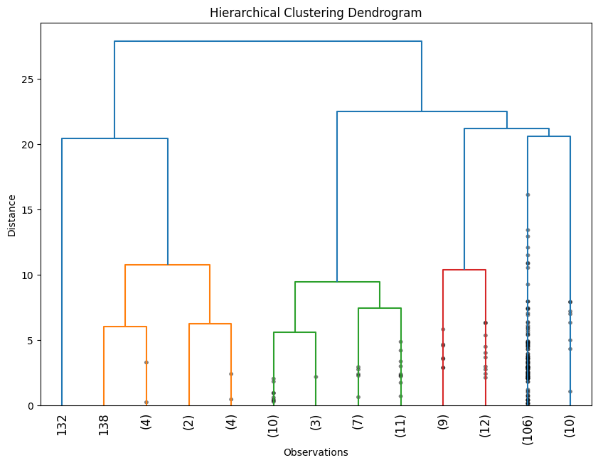

```{r setup, include=FALSE}
knitr::opts_chunk$set(echo = TRUE)
```

As we embark on this project, we seek to uncover the commonalities and attributes among a list of 180 typical travel destinations suggested by Priceline.com. Our goal is to use topic modeling to discover representative attributes for each group of similar destinations based on a variety of online sources and scraped documents from trusted websites. We will approach this question from multiple perspectives, including examining tabular attributes, general descriptions, and a combination of both to gain a comprehensive understanding of the destinations' characteristics.

The outcome of this project will be of great value to businesses in the travel industry, such as travel agencies, hotels, and airlines, who can utilize the insights to better target their customers and improve their services. Together, let us begin this important work and uncover the shared attributes and characteristics of these 180 typical travel destinations.

## World Map

Our interactive world map showcases 180 travel destinations, providing longitude and latitude coordinates for each city. With a simple click, users can explore popular destinations and plan their travel itinerary. The map is also a useful tool for businesses in the travel industry and researchers in tourism. We hope this map inspires travelers and provides valuable insights for the industry.

```{r, echo=FALSE, include=FALSE, message=FALSE, warning=FALSE}
library(devtools)
#devtools::install_github("rstudio/leaflet")
library(leaflet)
library(leaflet.extras)
library(leaflet.extras2)
library(readr)
library(tidyverse)
library(dplyr)
library(RColorBrewer)
library(ggplot2)
library(sf)
library(tmap)
library(patchwork)
library(grid)
```


```{r, echo=FALSE, message=FALSE, warning=FALSE}
# Import data
data <- read_csv("data/data_cluster.csv")

# Create pop-up content
pop_content <- paste("City Name: ", data$city_name, "<br/>",
                     "Longitude: ", data$longitude, "<br/>",
                     "Latitude: ", data$latitude, "<br/>")

# Create a leaflet map
leaflet(data) %>%
  setView(lng=mean(data$longitude), lat=mean(data$latitude), zoom=2) %>%
  addProviderTiles("Stamen.TonerLite") %>%
  addCircleMarkers(popup=pop_content, clusterOptions=markerClusterOptions(),
                   color="#F8D664")
```


## Key Patterns

We are pleased to introduce "Key Patterns," a comprehensive analysis of the number of visitors, temperature distribution, and climate type distribution of travel destinations. Our analysis of these key patterns can provide valuable insights for both travelers and businesses in the tourism industry. We hope that "Key Patterns" will be a useful resource for anyone interested in understanding travel trends and patterns.

### Number of Visitors in 2019

Our bar chart presents the top 10 travel destinations based on the number of visitors, providing a clear understanding of the most popular destinations in the world. This chart is a useful resource for travelers and businesses in the tourism industry in making informed decisions about where to visit and invest resources.

```{r, echo=FALSE, message=FALSE, warning=FALSE}
# Change column names
colnames(data)[10] <- "visitor_2019_million"
colnames(data)[22] <- "winter_sports"
colnames(data)[23] <- "sea_sports"
colnames(data)[24] <- "old_town"
colnames(data)[27] <- "horseback_riding"
colnames(data)[29] <- "climate_type"
colnames(data)[30] <- "hemishpere"
colnames(data)[31] <- "dec_feb_temp"
colnames(data)[32] <- "jun_aug_temp"
colnames(data)[33] <- "near_unesco"
colnames(data)[36] <- "todo_30"
```


```{r, echo=FALSE, message=FALSE, warning=FALSE}
# Filter the top 10 cities by number of visitors in 2019
top10 <- data %>%
  arrange(desc(visitor_2019_million)) %>%
  mutate(rank=row_number()) %>%
  filter(rank<=10)

# Create a bar chart
ggplot(top10, aes(x=reorder(city_name, visitor_2019_million), y=visitor_2019_million)) +
  geom_bar(stat="identity", fill="#F8D664") +
  coord_flip() +
  labs(x="",
       y="Number of Visitors (in million)",
       caption=element_text("Data Source: World Tourism Organization")) +
  geom_text(aes(label=visitor_2019_million),
            vjust=0.3,
            hjust=-0.05,
            show.legend=FALSE) +
  theme_classic() +
  theme(axis.line.y=element_blank(),
        axis.line.x=element_blank(),
        axis.text.x=element_blank(),
        axis.ticks.x=element_blank(),
        axis.ticks.y=element_blank(),
        panel.grid.major=element_blank(),
        panel.grid.minor=element_blank(),
        plot.title=element_text(hjust=0.5, vjust=5),
        plot.caption=element_text(hjust=0.5),
        plot.margin=unit(c(1,-0.1,0,-0.4), "cm")) +
  expand_limits(y=c(0,90)) +
  plot_annotation(
    title="Top 10 Destinations by Visitors in 2019",
    theme = theme(plot.title = element_text(hjust = 0.5, size = 16, face = "bold"))
  )
```


This visualization presents a comparison of the distribution of average temperature for two different time periods - December to February and June to August. The density plots provide an overview of the temperature distribution for different regions.

```{r, echo=FALSE, message=FALSE, warning=FALSE}
# Create density plot for displaying temperature distribution
# Temp for dec to feb
dec_feb <- ggplot(data, aes(x=dec_feb_temp)) +
  geom_density(color="white", fill="#F8D664", alpha=0.5) +
  labs(x="Dec. to Feb. Avg Temp (°F)",
       y="") +
  theme_classic() +
  theme(axis.line.y=element_blank(),
        axis.line.x=element_blank(),
        axis.ticks.y=element_blank(),
        axis.text.y=element_blank(),
        plot.title=element_text(hjust=0.5, vjust=5),
        plot.caption=element_text(hjust=0.5),
        plot.margin=unit(c(1,-0.1,0,-0.4), "cm")
        )

# Temp for jun to aug
jun_aug <- ggplot(data, aes(x=jun_aug_temp)) +
  geom_density(color="white", fill="#F8D664", alpha=1) +
  labs(x="Jun. to Aug. Avg Temp (°F)",
       y="") +
  theme_classic() +
  theme(axis.line.y=element_blank(),
        axis.line.x=element_blank(),
        axis.ticks.y=element_blank(),
        axis.text.y=element_blank(),
        plot.title=element_text(hjust=0.5, vjust=5),
        plot.caption=element_text(hjust=0.5),
        plot.margin=unit(c(1,-0.1,0,-0.4), "cm")
        )

# Patchwork
plot <- (dec_feb + jun_aug) +
  plot_annotation(
    title="Distribution of the Average Temperature",
    theme = theme(plot.title = element_text(hjust = 0.5, size = 16, face="bold"))
  )
plot
```


This plot visualizes the distribution of climate types across different cities, with each bar representing the number of cities in a particular climate type. 

```{r, echo=FALSE, message=FALSE, warning=FALSE}
# Find unique values of climate_type
data$climate_type <- tolower(data$climate_type)

# Count cities of each climate type
climate_group <- data %>%
  group_by(climate_type) %>%
  summarize(count=n()) %>%
  arrange(desc(count))

# Define colors
my_colors <- c("#fcf1cc", "#fae7a5", "#f9dc7e", "#f7d257", "#f5c830",
            "#f2bc0a", "#ca9e09", "#a37f07", "#7c6105", "#554303")

# Create a bar chart
ggplot(climate_group, aes(x = reorder(climate_type, count), y = count)) +
  geom_bar(fill = my_colors, stat = "identity") +
  coord_flip() +
  xlab("") +
  ylab("Number of Cities") +
  labs(caption="Data Source: Wikipedia") +
  geom_text(aes(label=count),
            vjust=0.3,
            hjust=-0.1,
            show.legend=FALSE) +
  theme_classic() +
  theme(axis.line.y=element_blank(),
        axis.line.x=element_blank(),
        axis.text.x=element_blank(),
        axis.ticks.x=element_blank(),
        axis.ticks.y=element_blank(),
        panel.grid.major=element_blank(),
        panel.grid.minor=element_blank(),
        plot.title=element_text(hjust=0.5, vjust=5),
        plot.caption=element_text(hjust=0.5)) +
  plot_annotation(
    title="Distribution of Climate Types",
    theme = theme(plot.title = element_text(hjust = 0.5, size = 16, face = "bold"))
  )

```

## City Clusters



"Outdoor Adventure Destinations Cluster" has high values for mountain, beach, forest, hiking, and horseback riding, suggesting that it may be a cluster of destinations that are popular for outdoor activities.

"Water-based Cultural Tourism Destinations Cluster" has high values for beach, island, lake, sea sports, and UNESCO World Heritage Sites, suggesting that it may be a cluster of destinations that are popular for water-based activities and cultural tourism.

"Cold Climate Outdoor Activity Destinations Cluster" has high values for lake, forest, winter sports, and horseback riding, suggesting that it may be a cluster of destinations that are popular for outdoor activities in colder climates.

"Mountainous Outdoor Adventure Destinations Cluster" has high values for mountain, lake, forest, hiking, and horseback riding, suggesting that it may be a cluster of destinations that are popular for outdoor activities in mountainous regions.

"Leisurely Coastal/Tropical Outdoor Activity Destinations Cluster" has high values for beach, island, golf, and sea sports, suggesting that it may be a cluster of destinations that are popular for leisurely outdoor activities in tropical or coastal areas.

"Summer Water Activity Destination Cluster" has only one member, so it may not be meaningful to analyze its distinct features. However, we can see that this destination has high values for beach, lake, and Jun-Aug Average Temperature, indicating that it may be a popular summer destination with a focus on water activities.

## Patterns within Clusters


```{r}
# Create a list of the top 10 most variant variables
top_vars <- c("resort", "x-sports", "mountain", "sea_sports", "island", "lake", "volcano", "winter_sports", "desert", "beach")

mean_data <- data %>% 
  group_by(cluster) %>% 
  summarize(across(all_of(top_vars), mean))
```

```{r}
str(mean_data)
```


```{r}
# create a custom color palette for the clusters
cluster_colors <- c("#fcf1cc", "#a37f07", "#f5c830", "#7c6105", "#f9dc7e", "#f2bc0a")

bar1 <- ggplot(mean_data, aes(x = factor(cluster), y = resort, fill = factor(cluster))) +
  geom_bar(stat = "identity", position = "dodge") +
  labs(x = "Cluster", y = "Resort") +
  ggtitle("Resort") +
  scale_fill_manual(values = cluster_colors) +
  theme(legend.position = "none",
        axis.title.y = element_blank(),
        plot.title = element_text(hjust = 0.5))

bar2 <- ggplot(mean_data, aes(x = factor(cluster), y = `x-sports`, fill = factor(cluster))) +
  geom_bar(stat = "identity", position = "dodge") +
  labs(x = "Cluster", y = "X-sports") +
  ggtitle("X-sports") +
  scale_fill_manual(values = cluster_colors) +
  theme(legend.position = "none",
        axis.title.x = element_blank(),
        axis.title.y = element_blank(),
        plot.title = element_text(hjust = 0.5))

bar3 <- ggplot(mean_data, aes(x = factor(cluster), y = mountain, fill = factor(cluster))) +
  geom_bar(stat = "identity", position = "dodge") +
  labs(x = "Cluster", y = "Mountain") +
  ggtitle("Mountain") +
  scale_fill_manual(values = cluster_colors) +
  theme(legend.position = "none",
        axis.title.x = element_blank(),
        axis.title.y = element_blank(),
        plot.title = element_text(hjust = 0.5))

bar4 <- ggplot(mean_data, aes(x = factor(cluster), y = sea_sports, fill = factor(cluster))) +
  geom_bar(stat = "identity", position = "dodge") +
  labs(x = "Cluster", y = "Sea Sports") +
  ggtitle("Sea Sports") +
  scale_fill_manual(values = cluster_colors) +
  theme(legend.position = "none",
        axis.title.x = element_blank(),
        axis.title.y = element_blank(),
        plot.title = element_text(hjust = 0.5))

bar5 <- ggplot(mean_data, aes(x = factor(cluster), y = island, fill = factor(cluster))) +
  geom_bar(stat = "identity", position = "dodge") +
  labs(x = "Cluster", y = "Island") +
  ggtitle("Island") +
  scale_fill_manual(values = cluster_colors) +
  theme(legend.position = "none",
        axis.title.x = element_blank(),
        axis.title.y = element_blank(),
        plot.title = element_text(hjust = 0.5))

bar6 <- ggplot(mean_data, aes(x = factor(cluster), y = lake, fill = factor(cluster))) +
  geom_bar(stat = "identity", position = "dodge") +
  labs(x = "Cluster", y = "Lake") +
  ggtitle("Lake") +
  scale_fill_manual(values = cluster_colors) +
  theme(legend.position = "none",
        axis.title.x = element_blank(),
        axis.title.y = element_blank(),
        plot.title = element_text(hjust = 0.5))

bar7 <- ggplot(mean_data, aes(x = factor(cluster), y = volcano, fill = factor(cluster))) +
  geom_bar(stat = "identity", position = "dodge") +
  labs(x = "Cluster", y = "Volcano") +
  ggtitle("Volcano") +
  scale_fill_manual(values = cluster_colors) +
  theme(legend.position = "none",
        axis.title.x = element_blank(),
        axis.title.y = element_blank(),
        plot.title = element_text(hjust = 0.5))

bar8 <- ggplot(mean_data, aes(x = factor(cluster), y = winter_sports, fill = factor(cluster))) +
  geom_bar(stat = "identity", position = "dodge") +
  labs(x = "Cluster", y = "Winter Sports") +
  ggtitle("Winter Sports") +
  scale_fill_manual(values = cluster_colors) +
  theme(legend.position = "none",
        axis.title.x = element_blank(),
        axis.title.y = element_blank(),
        plot.title = element_text(hjust = 0.5))

bar9 <- ggplot(mean_data, aes(x = factor(cluster), y = desert, fill = factor(cluster))) +
  geom_bar(stat = "identity", position = "dodge") +
  labs(x = "Cluster", y = "Desert") +
  ggtitle("Desert") +
  scale_fill_manual(values = cluster_colors) +
  theme(legend.position = "none",
        axis.title.x = element_blank(),
        axis.title.y = element_blank(),
        plot.title = element_text(hjust = 0.5))

(bar1 + bar2 + bar3 + bar4 + bar5 + bar6 + bar7 + bar8 + bar9)
```


## Text Analysis


```{r, echo=FALSE, message=FALSE, warning=FALSE}
# Analyze two text sources separately
library(stringr)
library(tm)
library(wordcloud)
library(wordcloud2)

# Import cleaned data
data_t <- data
#data_t <- data_t %>%
  #filter(beach==0)
trip_text <- data_t$trip_clean


# To corpus
docs_trip <- Corpus(VectorSource(trip_text))


# Calculate frequencies
dtm_trip <- DocumentTermMatrix(docs_trip)

m_trip <- as.matrix(dtm_trip)

freq_trip <- sort(colSums(m_trip), decreasing=TRUE)

df_trip <- data.frame(freq_trip=names(freq_trip), freq=freq_trip)


# Define color for word cloud
wc.color <- c("#7c6105", "#f2bc0a", "#f9dc7e")

# Filter words
df_trip <- df_trip %>%
  filter(freq>5)


# Define "same length" function
rep.len <- function(x, length.out) {
  rep(x, length.out = length.out)
}
```


This interactive Word Cloud displays the most commonly used words to describe travel destinations. The size of each word reflects its frequency of use, and clicking on a word shows the number of times it was used. 

```{r, echo=FALSE, message=FALSE, warning=FALSE}
#wc1 <- wordcloud2(df_trip,
           #color=rep.len(wc.color, nrow(df_trip)),
           #size=0.8,
           #rotateRatio=0)
#wc1
wordcloud2::wordcloud2(df_trip,
           color=rep.len(wc.color, nrow(df_trip)),
           size=0.8,
           rotateRatio=0)
```

Text

```{r, echo=FALSE, message=FALSE, warning=FALSE}
#wiki_text <- data_t$para_clean
#docs_wiki <- Corpus(VectorSource(wiki_text))
#dtm_wiki <- DocumentTermMatrix(docs_wiki)
#m_wiki <- as.matrix(dtm_wiki)
#freq_wiki <- sort(colSums(m_wiki), decreasing=TRUE)
#df_wiki <- data.frame(freq_wiki=names(freq_wiki), freq=freq_wiki)
#df_wiki <- df_wiki %>%
  #filter(freq>700)

#wc2 <- wordcloud2(df_wiki,
           #color=rep.len(wc.color, nrow(df_wiki)),
           #size=1,
           #rotateRatio=0)
```


## Conclusions

We conducted this project on 180 travel destinations to find commonalities and attributes that make some more similar than others. We collected data from reliable websites, such as TripAdvisor, and used topic modeling to find representative attributes for each group of destinations. We visualized the data using a world map, bar charts, word cloud, and density plot and made them interactive for users to explore. In conclusion, we found distinct clusters of destinations based on their attributes and activities, which can help in marketing for travel agencies and promoting these destinations to travelers. 

